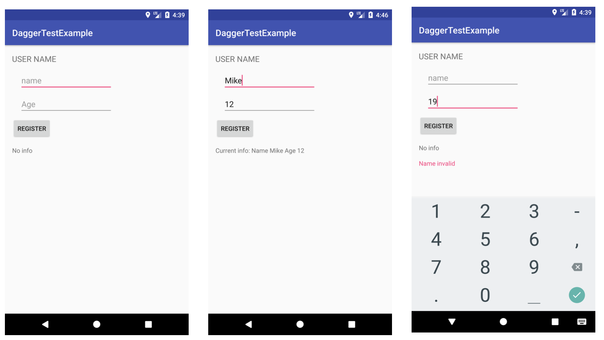

# Writing Espresso Instrumental test with Dagger2 + Kotlin

This is a sample project that explains how to run instrumentation tests using Dagger2 and Kotlin

This app has a simple registration screen. The project follows MVVM architecture and RxJava2 is used to implement Observer Pattern.
Instrumentation tests run with this sample project.

- Displays “No info” by default
- Displays Name and Age when the input is legit
- Displays an error message(“Name invalid”) when Name is not set